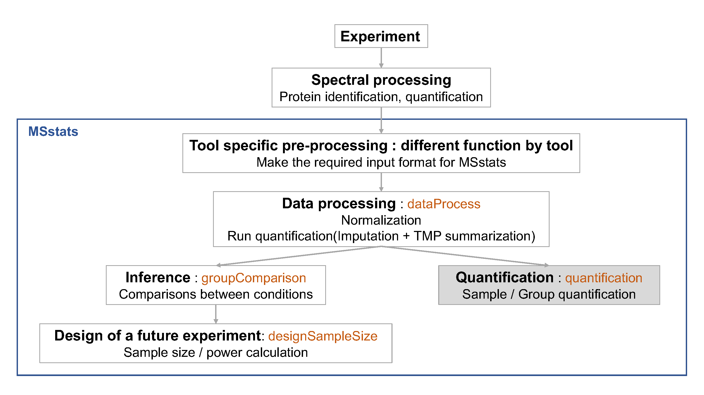

# Day 1 - Section 3 : MSstats, Differential abundance and sample size calculation

## Summary
- Significance analysis for MS proteomics based peak intenesities data

## Data
- The processed data, `quant.skyline.rda`, `quant.maxquant.rda`, `quant.openms.rda`, `quant.progenesis.rda`, which is output of `dataProcess` from section 2.


***
## Load MSstats

Load MSstats first. Then you are ready to start MSstats. 

```{r, eval=F, echo=T, warning=F}
library(MSstats)
?MSstats
```

```{r, eval=T, echo=F, warning=F}
#library(MSstats, warn.conflicts = F, quietly = T, verbose = F)
library(MSstats)

?MSstats
```

## Inference and future design of experiment with Skyline output

### Load the processed data (output of `dataProcess`) of Skyline output

```{r, echo=T}
load(file='data/data_Skyline/quant.skyline.rda')
```


***
### Finding differentially abundant proteins across conditions

{width=90%}


#### Assign contrast matrix

After we normalized the data and summarized each protein's behaviour across conditions in `dataProcess` step, we are all set to compare protein changes between groups of conditions. Within MSstats we can do this with the `groupComparison` function, which takes as input the output of the `dataProcess` function. 

```{r}
?groupComparison
```

We have to tell `groupComparison` which are the conditions we would like to compare.
You can make your `contrast.matrix` in R in a text editor. We define our contrast matrix by adding a column for every condition, **in alphabetical order**. We add a row for every comparison we would like to make between groups of conditions.  

**0** is for conditions we would like to ignore.
**1** is for conditions we would like to put in the numerator of the ratio or fold-change.
**-1** is for conditions we would like to put in the denumerator of the ratio or fold-change.

If you have multiple groups, you can assign any gruop comparisons you are interested in. For example, if you have 4 different conditions, Condition1, Condition2, Condition3, Condition4, there are many possible comparisons.

```{r, eval=TRUE}
# check unique conditions and check order of condition information
# In this case, Disease and Healthy
unique(quant.skyline$ProcessedData$GROUP_ORIGINAL)

comparison1<-matrix(c(-1,1,0,0),nrow=1)
comparison2<-matrix(c(-1,0,1,0),nrow=1)
comparison<-rbind(comparison1, comparison2)
row.names(comparison)<-c("C2-C1","C3-C1")

comparison
```

> Challenges
>
> Make the matrix, named `comparison`, for all 6 paired comparision among 4 conditions (condition1, condition2, condition3, condition4)

<details>
```{r, eval=TRUE}
unique(quant.skyline$ProcessedData$GROUP_ORIGINAL)

comparison1<-matrix(c(-1,1,0,0),nrow=1)
comparison2<-matrix(c(-1,0,1,0),nrow=1)
comparison3<-matrix(c(-1,0,0,1),nrow=1)
comparison4<-matrix(c(0,-1,1,0),nrow=1)
comparison5<-matrix(c(0,-1,0,1),nrow=1)
comparison6<-matrix(c(0,0,-1,1),nrow=1)
comparison<-rbind(comparison1, comparison2, comparison3, comparison4, comparison5, comparison6)
row.names(comparison)<-c("C2-C1","C3-C1","C4-C1","C3-C2","C4-C2","C4-C3")

comparison
```
</details>

#### Comparing conditions with `groupComparison` 

`groupComparison` uses the run-level summarized data (`$RunlevelData` from `dataProcess` function) for hypothesis testing.

```{r, eval=F, message=F, warning=F}
test.skyline <- groupComparison(contrast.matrix=comparison, data=quant.skyline)
```

```{r, echo=F}
load(file='data/data_Skyline/test.skyline.rda')
```

Let's check the output.

```{r, eval=TRUE}
class(test.skyline)

names(test.skyline)

# Show test result
# Label : which comparison is used
# log2FC : estimated log2 fold change between Diseased and Healthy
# adj.pvalue : adjusted p value
# issue : detect whether this protein has any issue for comparison
#    such as, there is measurement in certain group, or no measurement at all.
# MissingPercentage : the number of missing intensities/total number of intensities 
#     in conditions your are interested in for comparison
# ImputationPercentage : the number of imputed intensities/total number of intensities 
#     in conditions your are interested in for comparison
head(test.skyline$ComparisonResult)

# After fitting linear model, residuals and fitted values can be shown.
head(test.skyline$ModelQC)

# Fitted model per protein
head(test.skyline$fittedmodel)
test.skyline$fittedmodel[[1]]
```

#### Save the comparison result 

Let's save the testing result as rdata and .csv file.

```{r, eval=T, message=F, warning=F}
Skyline.result <- test.skyline$ComparisonResult

save(Skyline.result, file='data/data_Skyline/Skyline.result.rda')
write.csv(Skyline.result, file='data/data_Skyline/testResult_ABRF_skyline.csv')
```

#### subset of significant comparisons

Let's inspect the results to see what proteins are changing significantly between Diseased and Healthy.

```{r, eval=TRUE}
head(Skyline.result)

# select subset of rows with adj.pvalue < 0.05
SignificantProteins <- 
  Skyline.result[Skyline.result$adj.pvalue < 0.05, ]

nrow(SignificantProteins)

# select subset of rows with adj.pvalue < 0.05 and log2FC > 2
SignificantProteinsUpInDiseased <- SignificantProteins[SignificantProteins$log2FC > 2 ,]

nrow(SignificantProteinsUpInDiseased)
```


***

### Visualization of differentially abundant proteins

```{r, eval=FALSE}
?groupComparisonPlots
```

#### Volcano plot

Volcano plots allow us to visually separate strong changes, which are not significant, from strong and significant changes. Look for these subjects in the upper right and upper left quadrants of the plot. Protein name will be shown only for siginificant proteins.

```{r, eval=F}
groupComparisonPlots(data = Skyline.result, 
                     type = 'VolcanoPlot',
                     address = 'data/data_Skyline/testResult_ABRF_skyline_')
```

{width=60%}

We can set up estimated fold change cutoff.

```{r, eval=F}
groupComparisonPlots(data = Skyline.result, 
                     type = 'VolcanoPlot',
                     sig = 0.05, 
                     FCcutoff = 2^2, 
                     address = 'data/data_Skyline/testResult_ABRF_skyline_FCcutoff4_')
```


{width=60%}

#### Comparison plot

Comparison plots illustrate model-based estimates of log-fold changes, and the associated
uncertainty, in several comparisons of conditions for one protein. X-axis is the comparison of
interest. Y-axis is the log fold change. The dots are the model-based estimates of log-fold
change, and the error bars are the model-based 95% confidence intervals (the option sig can
be used to change the significance level of significance). For simplicity, the confidence intervals
are adjusted for multiple comparisons within protein only, using the Bonferroni approach. For
proteins with N comparisons, the individual confidence intervals are at the level of 1-sig/N.


```{r, eval=F}
groupComparisonPlots(Skyline.result, 
                     type="ComparisonPlot", 
                     address="data/data_Skyline/testResult_ABRF_skyline_")
```


{width=60%}

Let's check the comparison result for protein `sp|P44015|VAC2_YEAST`.

```{r}
Skyline.result[Skyline.result$Protein == 'sp|P44015|VAC2_YEAST', ]
```


***

### Planning future experimental designs


{width=90%}


This last analysis step views the dataset as a pilot study of a future experiment, utilizes its variance components, and calculates the minimal number of replicates required in a future
experiment to achieve the desired statistical power. The calculation is performed by the function `designSampleSize`, which takes as input the fitted model in `groupComparison`. Sample size calculation assumes same experimental design (i.e. group comparison, time course or paired design) as in the current dataset, and uses the model fit to estimate the median variance components across all the proteins. Finally, sample size calculation assumes that a large proportion of proteins (specifically, 99%) will not change in abundance in the future experiment. This assumption also provides conservative results.
Using the estimated variance components, the function relates the number of biological replicates per condition (`numSample`, rounded to 0 decimal), average statistical power across all the proteins (`power`), minimal fold change that we would like to detect (can be specified as a range, e.g. `desiredFC=c(1.1, 2)`), and the False Discovery Rate (`FDR`). The user should specify all these quantities but one, and the function will solve for the remainder. The quantity to solve for should be set to `= TRUE`.


```{r, eval=FALSE}
?designSampleSize
```


#### Calculating statistical power 

```{r, eval=T}
# calculate the power
test.power <- designSampleSize(data = test.skyline$fittedmodel, 
                               desiredFC = c(1.1, 1.6), 
                               FDR = 0.05,
                               power = TRUE,
                               numSample = 3)
test.power
```

#### Visualizing the relationship between desired fold-change and power

```{r, eval=T}
designSampleSizePlots(data = test.power)
```


#### Designing sample size for desired fold-change

```{r, eval=T}
# Minimal number of biological replicates per condition
samplesize <- designSampleSize(data = test.skyline$fittedmodel, 
                               desiredFC = c(1.1, 1.6), 
                               FDR = 0.05,
                               power = 0.9,
                               numSample = TRUE)
samplesize
```


#### Visualizing the relationship between desired fold-change and mininum sample size number

```{r, eval=T}
designSampleSizePlots(data = samplesize)
```


***

### Protein subject quantification 

{width=90%}

If there is no technical replicate, subject (or sample) quantification should be the same as run-level summarization. If there are technical replicates, subjet-level summarization(quantification) with run-level summarization will be useful for downstream analysis, such as classification.

```{r, eval=FALSE}
?quantification
```

```{r}
sampleQuant <- quantification(quant.skyline)
head(sampleQuant)
```

```{r}
groupQuant <- quantification(quant.skyline, type='Group')
head(groupQuant)
```


***

### msstats.log and sessionInfo.txt

These two files are important to keep the records of package versions and options in functions.

{width=90%}

***
## Inference and future design of experiment with Skyline output

>
> Challenges
>
> Load the processed data (output of dataProcess from section 2 of MaxQuant output and 1) find the differentially abundant comparisons using `groupComparison` with the same `comparison` matrix, 2) draw volcano plot with output of `groupComparison`, and 3) draw comparison plot with output of `groupComparison` with MaxQuant output. and Check the comparison plot for the protein, `P55249`. 

<details>
```{r, echo=T, eval=F}
load(file='data/data_MaxQuant/quant.maxquant.rda')

test.maxquant <- groupComparison(contrast.matrix=comparison, data=quant.maxquant)
MaxQuant.result <- test.maxquant$ComparisonResult
write.csv(MaxQuant.result, file='data/data_MaxQuant/testResult_ABRF_maxquant.csv')

groupComparisonPlots(data = MaxQuant.result, 
                     type = 'VolcanoPlot',
                     address = 'data/data_MaxQuant/testResult_ABRF_maxquant_')

groupComparisonPlots(data = MaxQuant.result, 
                     type = 'ComparisonPlot',
                     which.Protein = 'P55249',
                     address = 'data/data_MaxQuant/testResult_ABRF_maxquant_')
```
</details>

***
## Inference and future design of experiment with OpenMS output

>
> Challenges

> Load the processed data (output of dataProcess from section 2 of OpenMS output and 1) find the differentially abundant comparisons using `groupComparison` with the same `comparison` matrix, 2) draw volcano plot with output of `groupComparison`, and 3) draw comparison plot with output of `groupComparison` with OpenMS output. and Check the comparison plot for the protein, `sp|P55249|ZRT4_YEAST`. 

<details>
```{r, echo=T, eval=F}
load(file='data/data_OpenMS/quant.openms.rda')

test.openms <- groupComparison(contrast.matrix=comparison, data=quant.openms)
OpenMS.result <- test.openms$ComparisonResult
write.csv(OpenMS.result, file='data/data_OpenMS/testResult_ABRF_openms.csv')

groupComparisonPlots(data = MaxQuant.result, 
                     type = 'VolcanoPlot',
                     address = 'data/data_OpenMS/testResult_ABRF_openms_')

groupComparisonPlots(data = MaxQuant.result, 
                     type = 'ComparisonPlot',
                     which.Protein = 'sp|P55249|ZRT4_YEAST',
                     address = 'data/data_OpenMS/testResult_ABRF_openms_')
```
</details>


Here is the experimental design for ABRF 2015 study.
{width=70%}