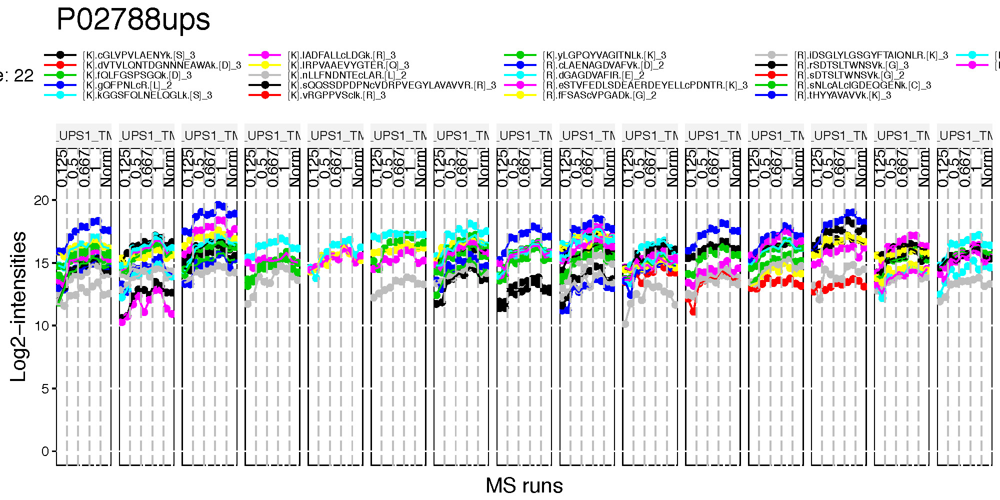
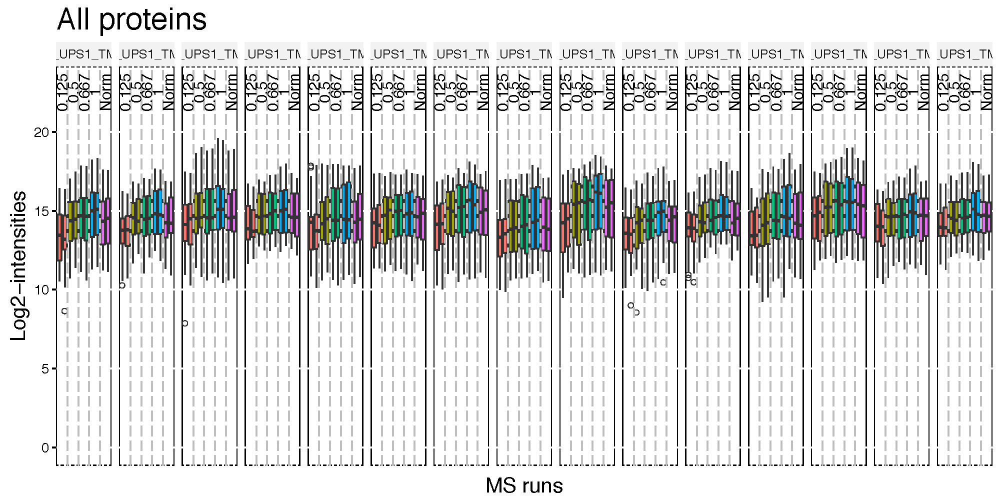
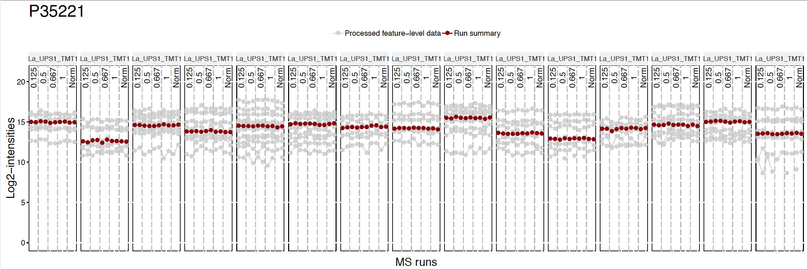

```{r setup, include=FALSE}
knitr::opts_chunk$set(echo = TRUE)
```

# Day 2 - Section 5 : MSstatsTMT, summarization, normalization and significance analysis

## Objective
- Channel-level summarization and normalization between runs

{ width=70% }

- Significance analysis for MS proteomics based peak intensities data

{ width=70% }

## Data
- The pre-processed data `input.pd.rda` from section 4.

***
## Process with processed PD data

Let's start processing steps. It includes log transformation of intensities, channel-level summarization and normalization between MS runs.

***

Load MSstatsTMT first. Then we are ready to start MSstatsTMT. 

```{r, echo=T, warning=F}
library(MSstatsTMT)
?MSstatsTMT
```

### Load the pre-processed data of PD output

```{r, echo=T}
load(file='data/data_ProteomeDiscoverer_TMT/input.pd.rda')
```


### Normalizing and summarizing data with proteinSummarization
**! Always pay attention to the default options **  

After reading the datasets, `MSstatsTMT` performs 

* 1) logarithm transformation of `Intensity` column

* 2) channel-level summarization

* 3) run-to-run normalization for each protein based on reference channel


To get started with this function, visit the help section of `proteinSummarization ` first: 

```{r,eval=FALSE}
?proteinSummarization 
```

#### Default summarization and normalization options

`proteinSummarization` perform first (1) channel level summarization will be performed, which is robust parameter estimation by TMP (Tukey's median polish).

Then, (2) normalization between MS runs. TRUE(default) needs at least one normalization channel in each MS run, annotated by 'Norm' in Condition column. If there are multiple normalization channels, all the normalization channels are averaged for the normalization. FALSE will not perform normalization step.

Below show the default for all options in `proteinSummarization`

```{r, message=F, warning=F, results='hide'}
quant.pd <- proteinSummarization(data = input.pd, 
                             method = "msstats", 
                             normalization = TRUE)
```

```{r, message=F, warning=F}
save(quant.pd, file='data/data_ProteomeDiscoverer_TMT/quant.pd.rda')
```


Let's check output from `proteinSummarization`.

```{r, eval=T, echo=T}
# This table includes normalized channel-level log2 intensities. (column : Abundance)
# Now one summarized log2 intensities per Protein, Run, Channel.
head(quant.pd)
```

***

### Visualization of processed data

#### Profile plots

Profile plot is good visualization to check individual measurements. Each dot means one intensity per Run per Channel. Each panel represents one MS run and each dot within one panel is one channel within one Run. The dots are linked with line per feature. If line is disconnected, that means there is no value (missing value). Color means different peptides and charge stages. 


```{r, eval=F, message=F, warning=F}
# if you have many MS runs, adjust width of plot (make wider)
# Profile plot for the normalized data 
dataProcessPlotsTMT(data.psm=input.pd, # PSM-level data
                     data.summarization=quant.pd, # protein-level data
                     type='ProfilePlot', # choice of visualization
                     width = 15,
                     height = 5,
                     address="data/data_ProteomeDiscoverer_TMT/pd_norm_") 
```

`pd_norm_ProfilePlot.pdf` and `pd_norm_ProfilePlot_wSummarization.pdf` are generated in the current directory.

Then, Let's go though profile plots to see overall quality of data.

There are two pdfs for each protein, first is profile plot and second plot is profile plot with summarized and normalized data. This profile plot shows each peptide ions across runs and channels, grouped per condition. Each peptide has a different colour/type layout. 




This plot shows the same peptide ions in grey, with the values as summarized by the model overlayed in red.


Instead of making all profile plots for all proteins, we can make plot for individual protein. Here is the example of background protein, `P35221`
```{r, eval=F, message=F, warning=F}
dataProcessPlotsTMT(data.psm=input.pd, # PSM-level data
                     data.summarization=quant.pd, # protein-level data
                     type='ProfilePlot', # choice of visualization
                     width = 15,
                     height = 5,
                     which.Protein = 'P35221',
                     address="data/data_ProteomeDiscoverer_TMT/pd_norm_P35221_") 
```


#### Quality control plots

QC plot is good to see the distribution of peptide intensities per MS run and channels, and outliers. 

```{r, eval=F, message=F, warning=F}
# QC plot for peptide intensity data
dataProcessPlotsTMT(data.psm=input.pd, # PSM-level data
                     data.summarization=quant.pd, # protein-level data
                     type='QCPlot', # choice of visualization
                     width = 15,
                     height = 5,
                     address="data/data_ProteomeDiscoverer_TMT/pd_") 

```
Then, `pd_QCPlot.pdf` are generated in the current directory.




> **Challenge**
>
> This is the study design. Let's check visualization for other 3 proteins.
> 1. P02788ups
> 2. P02787ups
> 3. P26639


***

### Different parameter options for summarization and normalization

#### No normalization
No normalization is performed. If you don't want to do run-to-run normalization, you should use like below.
```{r, message=F, warning=F, results='hide'}
quant.pd.nonorm <-proteinSummarization(data = input.pd, 
                             method = "msstats", 
                             normalization = FALSE)

dataProcessPlotsTMT(data.psm = input.pd, # PSM-level data
                     data.summarization = quant.pd.nonorm, # protein-level data
                     type = 'ProfilePlot', # choice of visualization
                     width = 15,
                     height = 5,
                    originalPlot = FALSE,
                     which.Protein = 'P35221',
                     address="data/data_ProteomeDiscoverer_TMT/pd_noNorm_P35221_") 
```



#### Different summarization option

MSstatsTMT provides five different summarization methods for protein quantification. `msstats` is default, which we have used before. Now let's try another robust summarization method `Median`.

```{r, message=F, warning=F}
quant.pd.median <-proteinSummarization(data = input.pd, 
                             method = "Median", 
                             normalization = TRUE)

```

Run summarization is different.
```{r, message=F, warning=F}
dataProcessPlotsTMT(data.psm=input.pd, # PSM-level data
                     data.summarization=quant.pd.median, # protein-level data
                     type='ProfilePlot', # choice of visualization
                     width = 15,
                     height = 5,
                    originalPlot = FALSE,
                     which.Protein = 'P35221',
                     address="data/data_ProteomeDiscoverer_TMT/pd_median_P35221_") 
```


***

### Finding differentially abundant proteins across conditions

#### Assign contrast matrix

After we summarized each protein's behavior across conditions and normalized the data between runs in `proteinSummarization` step, we are all set to compare protein changes between groups of conditions. Within MSstatsTMT we can do this with the `groupComparisonTMT` function, which takes as input the output of the `proteinSummarization` function. 

```{r}
?groupComparisonTMT
```


We have to tell `groupComparisonTMT` which are the conditions we would like to compare.
You can make your `contrast.matrix` in R in a text editor. We define our contrast matrix by adding a column for every condition. We add a row for every comparison we would like to make between groups of conditions.  

**0** is for conditions we would like to ignore.
**1** is for conditions we would like to put in the numerator of the ratio or fold-change.
**-1** is for conditions we would like to put in the denumerator of the ratio or fold-change.

If you have multiple groups, you can assign any group comparisons you are interested in.

```{r, eval=TRUE}
# check unique conditions and check order of condition information
# In this case, four different concentrations
unique(quant.pd$Condition)

# 'Norm' will be removed during tesing and should be not considered in the contrast
comparison1<-matrix(c(-1,0,0,1),nrow=1) # 0.5-0.125
comparison2<-matrix(c(0,-1,1,0),nrow=1) # 0.667-0.5
comparison<-rbind(comparison1, comparison2)
# Set the column names
colnames(comparison)<- c("0.125", "0.5", "0.667", "1")
# Set the names of each row
row.names(comparison)<-c("1-0.125","0.667-0.5")

comparison
```

> **Challenges**
>
> Make the matrix, named `comparison`, for all 6 paired comparision among 4 conditions (condition1, condition2, condition3, condition4)
```{r, eval=TRUE}
unique(quant.pd$Condition)
comparison1<-matrix(c(-1,1,0,0),nrow=1)
comparison2<-matrix(c(-1,0,1,0),nrow=1)
comparison3<-matrix(c(-1,0,0,1),nrow=1)
comparison4<-matrix(c(0,-1,1,0),nrow=1)
comparison5<-matrix(c(0,-1,0,1),nrow=1)
comparison6<-matrix(c(0,0,-1,1),nrow=1)
comparison_all<-rbind(comparison1, comparison2, comparison3, comparison4, comparison5, comparison6)
# Set the column names
colnames(comparison_all)<- c("0.125", "0.5", "0.667", "1")
# Set the names of each row
row.names(comparison_all)<-c("0.5-0.125","0.667-0.125","1-0.125","0.667-0.5","1-0.5","1-0.667")
comparison_all
```

#### Group comparisons with `groupComparisonTMT` 

`groupComparisonTMT` uses the channel-level summarized data for hypothesis testing.

```{r, message=F, warning=F}
test.pd <- groupComparisonTMT(data = quant.pd, 
                               contrast.matrix = comparison,
                               remove_norm_channel = TRUE, # remove norm channels
                               moderated = TRUE, # do moderated t test
                               adj.method = "BH") # multiple comparison adjustment
```

Let's check the output.

```{r, eval=TRUE}
colnames(test.pd)

# Show test result
# Label : which comparison is used
# log2FC : estimated log2 fold change between two conditions (the contrast)
# adj.pvalue : adjusted p value
head(test.pd)
```

#### Save the comparison result 

Let's save the testing result as .csv file.

```{r, eval=T, message=F, warning=F}
save(test.pd, file='data/data_ProteomeDiscoverer_TMT/pd.result.rda')
write.csv(test.pd, file='data/data_ProteomeDiscoverer_TMT/testResult_pd.csv')
```

#### Significant tests

Let's inspect the results to see what proteins are changing significantly between two concentrations.

```{r, eval=TRUE}
head(test.pd)

# select subset of rows with adj.pvalue < 0.05
SignificantProteins <- 
  test.pd[test.pd$adj.pvalue <= 0.05 ,]

SignificantProteins

nrow(SignificantProteins)

# select subset of rows with adj.pvalue < 0.05 and absoluate log2FC > 1
SignificantProteinsLargeFC <- SignificantProteins[abs(SignificantProteins$log2FC) > 1 ,]
SignificantProteinsLargeFC
```

#### Different parameter options for group comparison

If you want to make all the pairwise comparison,`MSstatsTMT` has an easy option for it. Setting `contrast.matrix = pairwise` compares all the possible pairs between two conditions.

```{r, message=F, warning=F}
test.pd.pairwise <- groupComparisonTMT(data = quant.pd, 
                               contrast.matrix = "pairwise",
                               remove_norm_channel = TRUE, # remove norm channels
                               moderated = TRUE, # do moderated t test
                               adj.method = "BH") # multiple comparison adjustment

# show the comparisons
unique(test.pd.pairwise$Label)
```

### msstatstmt.log and sessionInfo.txt

These two files are important to keep the records of package versions and options in functions.


> **Challenges**
>
> 1. Try `proteinSummarization` with `msstats` summarization and between-runs normalization for MaxQuant output. (`input.maxquant.rda` from section 4)
```{r, echo=T, eval=F, message=F, warning=F}
load(file='data/data_MaxQuant_TMT/input.maxquant.rda')
quant.maxquant <-proteinSummarization(data = input.maxquant, 
                             method = "msstats", 
                             normalization = TRUE)
```

> 2. Try `proteinSummarization` with `msstats` summarization and without normalization for MaxQuant output. (`input.maxquant.rda` from section 4)
```{r, echo=T, eval=F, message=F, warning=F}
quant.maxquant.nonorm <-proteinSummarization(data = input.maxquant, 
                             method = "msstats", 
                             normalization = FALSE)
```

> 3. Draw Profile plots of protein `P26639`, for both cases above and compare.
```{r, echo=T, eval=F, message=F, warning=F}
dataProcessPlotsTMT(data.psm=input.maxquant, # PSM-level data
                     data.summarization=quant.maxquant, # protein-level data
                     type='ProfilePlot', # choice of visualization
                     width = 15,
                     height = 5,
                     which.Protein = 'P26639',
                     address="data/data_MaxQuant_TMT/maxquant_norm_P26639_")
dataProcessPlotsTMT(data.psm=input.maxquant, # PSM-level data
                     data.summarization=quant.maxquant.nonorm, # protein-level data
                     type='ProfilePlot', # choice of visualization
                     width = 15,
                     height = 5,
                     originalPlot = FALSE,
                     which.Protein = 'P26639',
                     address="data/data_MaxQuant_TMT/maxquant_nonorm_P26639_")
```

> 4. From `quant.maxquant` data, find the differentially abundant comparisons using `groupComparison` with the same `comparison` matrix.
```{r, echo=T, eval=F}
test.maxquant <- groupComparisonTMT(data = quant.maxquant, contrast.matrix = comparison)
write.csv(test.maxquant, file='data/data_MaxQuant_TMT/testResult_maxquant.csv')
```
***
