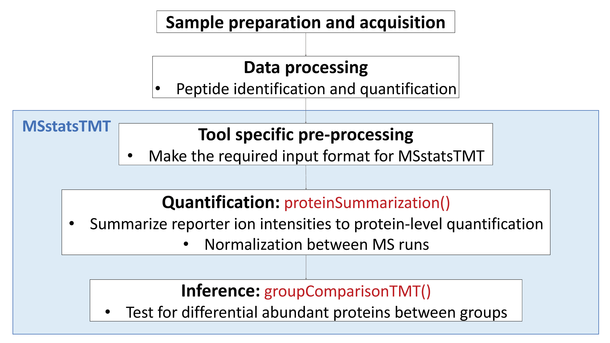

# Before we start {-}

Placeholder


## Suggested reading {-}
## Schedule {-}
## License {-}

<!--chapter:end:index.Rmd-->


# Day 1 - Section 1 : MSstats, introduction to data and preprocessing

Placeholder


## Objective
## Workflow in MSstats
## Data
## Load MSstats
## Allowable data formats
## Convert to MSstats required format (Data cleaning)
### Skyline output
#### Read data
#### Set annotation file
##### Common mistake for annotation file : Incorrect Run information
##### Common mistake for annotation file : Incorrect `BioReplicate` information
###### Group comparison 
###### Time course
###### Paired design
#### Preprocessing with `SkylinetoMSstatsFormat`
#### Preliminary check
### MaxQuant output
#### Read data
#### Set annotation file
#### Preprocessing with `MaxQtoMSstatsFormat`
#### Preliminary check
### OpenMS output
#### Read data
#### Set annotation file
#### Preprocessing with `OpenMStoMSstatsFormat`
#### Preliminary check for preprocessed data
### Progenesis output
#### Read data
#### Set annotation file
#### Preprocessing with `ProgenesistoMSstatsFormat`
#### Preliminary check for preprocessed data
## Save your work

<!--chapter:end:MayInst_P6_day1_sec1.Rmd-->


# Day 1 - Section 2 : MSstats, Data processing - Normalization and run summarization

Placeholder


## Data
## dataProcess with Skyline data
### Load MSstats
### Load the pre-processed data of Skyline output
### Normalizing and summarizing data with dataProcess
#### Default normalization and summarization options
### Visualization of processed data
#### Quality control plots
#### Profile plots
#### Condition plots
### Different normalization option
#### No normalization
#### Equalize medians normalization
#### Quantile normalization
#### Global standards normalization : example 1
#### Global standards normalization : example 2
### Different summarization option
#### No imputation, TMP summarization only
## dataProcess with MaxQuant data
## dataProcess with OpenMS data
## dataProcess with Progenesis data

<!--chapter:end:MayInst_P6_day1_sec2.Rmd-->


# Day 1 - Section 3 : MSstats, Differential abundance and sample size calculation

Placeholder


## Summary
## Data
## Load MSstats
## Inference and future design of experiment with Skyline output
### Load the processed data (output of `dataProcess`) of Skyline output
### Finding differentially abundant proteins across conditions
#### Assign contrast matrix
#### Comparing conditions with `groupComparison` 
#### Save the comparison result 
#### subset of significant comparisons
### Visualization of differentially abundant proteins
#### Volcano plot
#### Comparison plot
### Planning future experimental designs
#### Calculating statistical power 
#### Visualizing the relationship between desired fold-change and power
#### Designing sample size for desired fold-change
#### Visualizing the relationship between desired fold-change and mininum sample size number
### Protein subject quantification 
### msstats.log and sessionInfo.txt
## Inference and future design of experiment with Skyline output
## Inference and future design of experiment with OpenMS output

<!--chapter:end:MayInst_P6_day1_sec3.Rmd-->

---
title: "Statistics for quantitative mass spectrometry - Day 2"
subtitle: "Section 4 : MSstatsTMT, introductioin to data and preprocessing"
author: "Ting Huang"
date: "5/7/2018"
output: 
  html_document:
    self_contained: true
    toc: true
    toc_float: true
---

```{r setup, include=FALSE}
knitr::opts_chunk$set(echo = TRUE)
```

# Day 2 - Section 4 : MSstatsTMT, introductioin to data and preprocessing

## Objective

- Preprocessing steps to make required input format for MSstatsTMT from output from diverse output of spectral processing and peptide quantification tools.
- Make annotation file, based on experimental design.


***


## Data
- Controlled mixtures: Sigma UPS1 48 protein-mix were spiked at 4 different ratio into a SILAC-labelled HeLa lysate. The mixtures were measured by TMT 10-plexes.

- the peptide quantification data of controlled mixtures, processed by Proteome Discoverer and MaxQuant.


***

## Load MSstatsTMT

Load MSstatsTMT first. Then you are ready to start MSstats. 

```{r, eval=T, echo=T, warning=F}
# install MSstatsTMT from bioconductor
# if (!requireNamespace("BiocManager", quietly = TRUE))
#     install.packages("BiocManager")
# BiocManager::install("MSstatsTMT")

library(MSstatsTMT) # make sure it is version 1.2.1
?MSstatsTMT
```


***

## Allowable data formats

`MSstatsTMT` performs statistical analysis steps, that follow peptide identification and quantitation. Therefore, input to MSstatsTMT is the output of other software tools (such as `Proteome Discoverer`, `MaxQuant` and so on) that read raw spectral files
, identify and quantify peptide ions. The preferred structure of data for use in MSstatsTMT is a .csv file in a *long* format with at least 10 columns representing the following variables: **ProteinName**, **PeptideSequence**, **Charge**, **PSM**, **Channel**, **Condition**, **BioReplicate**, **Mixture**,  **TechRepMixture**, **Intensity**. The variable names are fixed, but are case-insensitive.

```{r, eval=T, echo=F, warning=F}
head(input.pd)
```


***
Let's start preprocessing steps to make required input format for MSstatsTMT from output from diverse output of peptide quantification tools.


## Proteome Discoverer output

### Read data

The required input data is the PSM-level data generated by `Proteome Discoverer 2.2`.
We first load and access the dataset processed by `Proteome Discoverer`. The file name is *'spikedin_PSMs.txt'*. 
```{r}
# Read output from Proteome Discoverer 
raw.pd <- read.delim(file="data/data_ProteomeDiscoverer_TMT/spikedin_PSMs.txt")
```

```{r}
# Check the column names
colnames(raw.pd)
```

The column names are differently from required input. Let's do preliminary check for this input.

```{r}
# total number of unique protein name
proteins <- unique(raw.pd$Protein.Accessions)
length(proteins)

# show the spiked-in proteins
proteins[grepl("ups",proteins)]

# total number of unique peptide names
length(unique(raw.pd$Annotated.Sequence))

# unique Spectrum.File, which is TMT run.
unique(raw.pd$Spectrum.File)
```


### Prepare annotation file

`MSstatsTMT` can make inference for group comparison design. In a group comparison design, the conditions (e.g., disease states) are profiled across **non-overlapping sets of biological replicates (i.e., subjects)**. In this example there are 4 conditions, 0.125, 0.5, 0.667, 1 (in general the number of conditions can vary). There are 2 subjects per condition per MS run (in general an equal number of replicates per condition is not required). Besides 2 pooled control replicates per run for across TMT-plex normalizations. Totally, each mixture has 10 replicates. There are 5 mixtures and each mixture has 3 technical replicate runs (in general technical replicates are not required, and their number per sample may vary). Overall, in this example there are 5 × 3 = 15 mass spectrometry runs and 5 × 3 x 10 = 150 replicates.

 `Mixture` |  `Run` 
-----------|---------
	1        |		161117_SILAC_HeLa_UPS1_TMT10_Mixture1_01.raw
	1        |		161117_SILAC_HeLa_UPS1_TMT10_Mixture1_01.raw
	1        |		161117_SILAC_HeLa_UPS1_TMT10_Mixture1_03.raw
	2        |		161117_SILAC_HeLa_UPS1_TMT10_Mixture1_01.raw
	2        |		161117_SILAC_HeLa_UPS1_TMT10_Mixture2_02.raw
	2        |		161117_SILAC_HeLa_UPS1_TMT10_Mixture2_03.raw
	3        |		161117_SILAC_HeLa_UPS1_TMT10_Mixture1_01.raw
	3        |		161117_SILAC_HeLa_UPS1_TMT10_Mixture3_02.raw
	3        |		161117_SILAC_HeLa_UPS1_TMT10_Mixture3_03.raw
	4        |		161117_SILAC_HeLa_UPS1_TMT10_Mixture4_01.raw
	4        |		161117_SILAC_HeLa_UPS1_TMT10_Mixture4_02.raw
	4        |		161117_SILAC_HeLa_UPS1_TMT10_Mixture4_03.raw
	5        |		161117_SILAC_HeLa_UPS1_TMT10_Mixture5_01.raw
	5        |		161117_SILAC_HeLa_UPS1_TMT10_Mixture5_02.raw
	5        |		161117_SILAC_HeLa_UPS1_TMT10_Mixture5_03.raw

Here show run **161117_SILAC_HeLa_UPS1_TMT10_Mixture1_01.raw** as an example,

 `Run` |  `Channel` | `BioReplicate` | `Condition`
-------|------------|----------------|-----------
	1    |		X127C    |     1.X127C     |    0.125
	1    |		X129N    |     1.X129N     |    0.125
	1    |		X128N    |     1.X128N     |    0.5
	1    |		X129C    |     1.X129C     |    0.5
	1    |		X127N    |     1.X127N     |    0.667
	1    |		X130C    |     1.X130C     |    0.667
	1    |		X128C    |     1.X128C     |    1
	1    |		X130N    |     1.X130N     |    1
	1    |		X126     |     1.X126      |    Norm
	1    |		X131     |     1.X131      |    Norm

The most important is that 1) `Run` is not order of spectral acquisition, but just unique MS run ID 2) if normalization between runs need to be done, then each run must have at least one `Norm` channel 3) `Channel` column in the annotation file should match with the corresponding channel names in in output of `Proteome Discoverer` 4) **Spectrum.File** in the PSM output of `Proteome Discoverer` should be the **Run** column in the annotation file 5) If one channel of one mixture doesn't have sample, put `None` under **Condition** and **BioReplicate** column .

Annotation information is required to fill in **Condition**, **TechRepMixture**, **Mixture** and **BioReplicate** for corresponding **Run** and **Channel** information. Users have to prepare as csv or txt file like 'PD_Annotation.csv', which includes **Run**, **Channel**, **Condition**, **BioReplicate**, **TechRepMixture** and **Mixture** information, and load it in R.

```{r}
annot.pd <- read.csv(file="data/data_ProteomeDiscoverer_TMT/PD_Annotation.csv")
head(annot.pd)
```


#### Prepare the file with run information

Raw Spectrum file name in the output of peptide quantification tool should be the Run information in the annotation file.

Let's start with **Spectrum.File** in PSM output of `Proteome Discoverer`.
```{r}
runs <- unique(raw.pd$Spectrum.File) # MS runs
runs
```
The run ID has the mixture and technical replicate information

Let's try to extract the mixture and technical replicate information.
```{r, message=FALSE, warning= FALSE}
library(tidyr)
library(dplyr)

Run_info <- data.frame(Run = runs) # initialize the run file

# use function separate()
?separate

## Add the mixture and technical replicate information
Run_info <- Run_info %>% 
  separate(Run, c("Mixture", "TechRepMixture"), sep="_0", remove = FALSE) 
Run_info
```

Then let's clean the Mixture ID and TechRepMixture ID
```{r}
## clean the run file and add fraction information 
Run_info <- Run_info %>% 
  mutate(Mixture = gsub("161117_SILAC_HeLa_UPS1_TMT10_", "", Mixture),
         TechRepMixture = gsub(".raw", "", TechRepMixture),
         Fraction = "F1")
Run_info
```

#### Prepare the file with group information
Let's add the group and biological replicate information for each channel in each mixture. The channel ID should be consistent with the reporter ion intensity columns in the PSM file of `Proteome Discoverer`.
```{r}
colnames(raw.pd)

## Channel ID in the PSM file
channels <- c("126", "127N", "127C", "128N", "128C", "129N", "129C", "130N", "130C", "131")
## Mixture ID from run file
mixtures <- unique(Run_info$Mixture)
mixtures

## create the file with channel information in each mixture
Group_info <- expand.grid(channels, mixtures)
colnames(Group_info) <- c("Channel", "Mixture")
head(Group_info)

## save the channel file and fill in the condition and biological replicate information manually
write.csv(Group_info, file = "Group_info.csv", row.names = FALSE)

## Now the condition information should be available in the file
Group_info_filled <- read.csv(file = "data/data_ProteomeDiscoverer_TMT/Group_info_pd.csv")
head(Group_info_filled)
```

#### Prepare the final annotation file
Let's generate the annotation file from run file and group file
```{r}
annotation <- full_join(Run_info, Group_info_filled)
nrow(annotation)

head(annotation)
```

### Preprocessing with `PDtoMSstatsTMTFormat`

The input data for `MSstatsTMT` is required to contain variables of **ProteinName**, **PeptideSequence**, **Charge**, **PSM**, **Channel**, **Condition**, **BioReplicate**,  **TechRepMixture**, **Mixture**, **Intensity**. These variable names should be fixed. Output from Proteome Discoverer have different columns from the required input of `MSstatsTMT`.  `PDtoMSstatsTMTFormat ` function helps pre-processing for making right format of MSstatsTMT input from Proteome Discoverer output. For example, it renames some column name, and remove shared peptides. 

Here is the summary of pre-processing steps in `PDtoMSstatsTMTFormat` function.

+ Peptide ions which are shared by more than one protein are removed
+ If one spectrum has multiple identifications within one run, it only keeps the best identification which has most measurements within that run or highest identification score or largest summation of all the measurements within that run
+ If one peptide ion has any missing value within one run, it removes the peptide ion from that run
+ For fractionation, it removes the shared peptide ions among the fractions of each mixture and then combine all the fractions for each mixture


For further details, visit the help file using the following code.
```{r, eval=F}
?PDtoMSstatsTMTFormat
```


```{r, message=F, warning=F}
# reformating and pre-processing for PD output.
input.pd <- PDtoMSstatsTMTFormat(raw.pd, annotation=annotation)
head(input.pd)
```


### Preliminary check

```{r}
# total number of proteins
proteins <- unique(input.pd$ProteinName)
length(proteins)

# show the spiked-in proteins
proteins[grepl("ups",proteins)]
```

### Save your work

We can save the data that we made so far.

```{r}
save(input.pd, file='data/data_ProteomeDiscoverer_TMT/input.pd.rda')
#write.csv(input.pd, file='data/data_ProteomeDiscoverer_TMT/input.pd.csv', row.names = FALSE)
```

***

## MaxQuant output

### Read data

Three files should be prepared before MSstatsTMT. Two files, ‘proteinGroups.txt’ and ‘evidence.txt’ are outputs from MaxQuant.

```{r}
# First, get protein ID information
proteinGroups <- read.table("data/data_MaxQuant_TMT/proteinGroups.txt", sep = "\t", header = TRUE)
```

```{r}
# Read in MaxQuant file: evidence.txt
evi <- read.table("data/data_MaxQuant_TMT/evidence.txt", sep="\t", header=TRUE)
colnames(evi)
unique(evi$Raw.file)
```

Again, we need file annotation file, required to fill in Condition, BioReplicate and Mixture for corresponding Run and Channel information. Users have to prepare as csv or txt file like ‘MaxQuant_annotation.csv’, which includes **Run**, **Channel**, **Condition**, **BioReplicate**, **TechRepMixture** and **Mixture** information, and load it in R.


### Set annotation file

**Run** column in the annotation file should be the same as unique **Raw.file** in evidence.txt file. **Channel** column in the annotation file should match with the corresponding channel names in evidence.txt file.

```{r}
# Read in annotation including condition and biological replicates: MaxQuant_annotation.csv
annot.maxquant <- read.csv("data/data_MaxQuant_TMT/MaxQuant_annotation.csv", header = TRUE)
head(annot.maxquant)
```


### Preprocessing with `MaxQtoMSstatsTMTFormat`

`MaxQtoMSstatsTMTFormat` function helps pre-processing for making right format of MSstatsTMT input from MaxQuant output. Basically, this function gets peptide ion intensity from `‘evidence.txt’` file. In addition, there are several steps to filter out or to modify the data in order to get required information.

Here is the summary of pre-processing steps in `MaxQtoMSstatsTMTFormat` function

+ Use `Proteins` in ‘proteinGroups.txt’ as protein ID
+ Peptide ions which are shared by more than one protein are removed
+ If one spectrum has multiple identifications within one run, it only keeps the best identification which has most measurements within that run or highest identification score or largest summation of all the measurements within that run
+ If one peptide ion has any missing value within one run, it removes the peptide ion from that run
+ For fractionation, it removes the shared peptide ions among the fractions of each mixture and then combine all the fractions for each mixture

```{r, eval=F}
?MaxQtoMSstatsTMTFormat
```

```{r, message=F, warning=F}
# reformating and pre-processing for MaxQuant output.
input.maxquant <- MaxQtoMSstatsTMTFormat(evidence=evi, 
                                      annotation=annot.maxquant,
                                      proteinGroups=proteinGroups)
head(input.maxquant)
```


### Preliminary check

```{r}
# total number of proteins
proteins <- unique(input.maxquant$ProteinName)
length(proteins)

# show the spiked-in proteins
proteins[grepl("ups",proteins)]
```

### Save your work

We can save the data that we made so far.

```{r}
save(input.maxquant, file='data/data_MaxQuant_TMT/input.maxquant.rda')
```

<!--chapter:end:MayInst_P6_day2_sec4.Rmd-->


# Day 2 - Section 5 : MSstatsTMT, summarization, normalization and significance analysis

Placeholder


## Objective
## Data
## Process with processed PD data
### Load the pre-processed data of PD output
### Normalizing and summarizing data with proteinSummarization
#### Default summarization and normalization options
### Visualization of processed data
#### Profile plots
#### Quality control plots
### Different parameter options for summarization and normalization
#### No normalization
#### Different summarization option
### Finding differentially abundant proteins across conditions
#### Assign contrast matrix
#### Group comparisons with `groupComparisonTMT` 
#### Save the comparison result 
#### Significant tests
#### Different parameter options for group comparison
### msstatstmt.log and sessionInfo.txt

<!--chapter:end:MayInst_P6_day2_sec5.Rmd-->


# Day 2 - Section 6 : Multivariate analysis and classification

Placeholder


## Data
## Protein quantification
### Read the protein level data from MSstatsTMT
### Protein quantification
### Deal with missing values
#### Only keep the subjects with less than 5% missing values
#### Impute the missing values
## Principal components analysis (PCA)
### PCA with `prcomp` function
### Check the proportion of explained variance
### Visualization for PC1 vs PC2
## Heatmap
### matrix format
### `heatmap` function in base `stats` package
### Color bar for group information
### Different distance and clustering
## Classification
### Training random forest with all the proteins
### Predict validation cohort

<!--chapter:end:MayInst_P6_day2_sec6.Rmd-->

